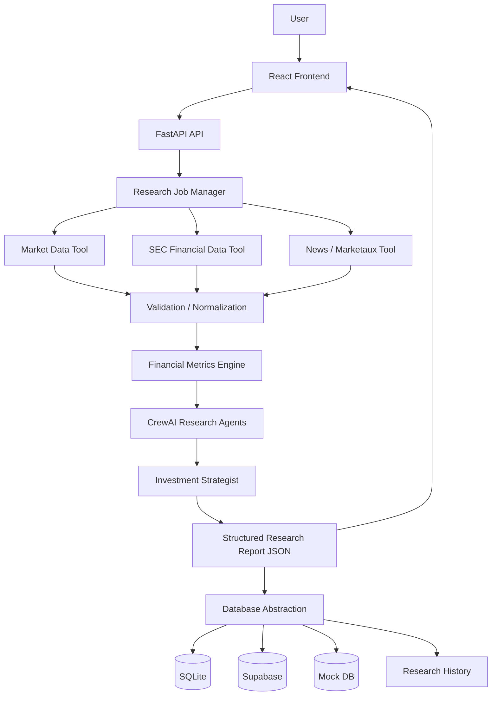

# AI Investment Research

An advanced, production-oriented AI-powered equity research platform that orchestrates specialized AI agents to analyze public companies. The platform combines real-time data retrieval, deterministic financial calculations, rigorous evidence tracking, and a premium React-based financial terminal interface.

The core architectural principle of this system is the strict separation of quantitative calculations from qualitative reasoning:

```
RETRIEVAL
    ↓
VALIDATION
    ↓
CALCULATION
    ↓
REASONING
    ↓
EVIDENCE
    ↓
PRESENTATION
```

By enforcing this flow, the platform guarantees that financial data (e.g., Gross Margins, ROE) is mathematically calculated from factual SEC filings and Yahoo Finance data, reducing the risk of numerical hallucinations. The LLM's role is strictly confined to reasoning, interpreting the deterministic data, and synthesizing investment theses.

---

## Table of Contents
1. [Overview](#1-overview)
2. [Features](#2-features)
3. [Architecture](#3-architecture)
4. [Prerequisites](#4-prerequisites)
5. [Installation & Setup](#5-installation--setup)
6. [Configuration](#6-configuration)
7. [Running the Application](#7-running-the-application)
8. [API Documentation](#8-api-documentation)
9. [Testing](#9-testing)

---

## 1. Overview

The AI Investment Research platform automates deep fundamental and quantitative equity research. It is designed for developers, financial analysts, and researchers who need a structured, verifiable, and visually dense AI research tool.

**Inputs:**
The system accepts a standard **Company Name** (e.g., "Apple Inc.") and **Ticker Symbol** (e.g., "AAPL").

**Outputs:**
A comprehensive, deeply structured JSON research report presented in a premium dark-mode dashboard. Outputs include deterministic financial snapshots, multi-scenario valuations, risk analysis, catalyst identification, and a final synthesized investment thesis with Buy/Hold/Sell recommendations.

---

## 2. Features

### AI Research
- Orchestrates multiple specialized agent roles using **CrewAI**:
  - `Market News Analyst`: Evaluates sentiment, macroeconomic conditions, and recent news.
  - `Risk Analyst`: Identifies structural, competitive, and financial risks.
  - `Valuation Analyst`: Interprets ratios, DCF inputs, and relative valuation.
  - `Investment Strategist`: Synthesizes the final thesis, scenarios, and recommendations.
- Powered by the **Google Gemini API** for deep qualitative reasoning.

### Financial & Market Data
- Retrieves live pricing, 52-week ranges, beta, and yields via **Yahoo Finance (`yfinance`)**.
- Retrieves primary financial statements directly from the **SEC EDGAR XBRL Company Facts API**.
- Retrieves market news and sentiment data via **Marketaux API**.

### Deterministic Financial Calculations
- The **Financial Metrics Engine** explicitly calculates all critical ratios prior to LLM reasoning.
- Computes Margins (Gross, Operating, Net, FCF), Returns (ROA, ROE), Efficiency (Asset Turnover, Equity Multiplier), and Growth (CAGR).
- Core financial calculations are performed deterministically from retrieved data, reducing the risk of numerical hallucinations.

### Evidence & Provenance
- Implements an **Evidence Registry** that tracks the exact source, unit, and period for every critical data point.
- Differentiates between retrieved facts, calculated metrics, and AI-generated opinions.

### Research History & Persistence
- Uses an asynchronous background job system.
- **Asynchronous Execution:** Background tasks enable long-running generation without blocking HTTP endpoints.
- **Cloud Persistence:** Supports Supabase PostgreSQL persistence for research jobs, while automated tests use an isolated mock database. Default local execution uses SQLite.

### 5. Evaluation & Reliability Layer
- **Deterministic Pipeline Tests:** Extensive mocked regression suites across multiple failure scenarios.
- **Evaluation Mechanism (`utils/evaluation.py`):** Scores final reports deterministically based on data completeness, evidence coverage, and schema validity.
- **Graceful Degradation:** The pipeline catches HTTP timeouts and missing financials securely without hallucinating inputs.
- Features a full **Research History** page with route-based reloading (`/research/:jobId`) of historical reports.

### Dashboard
- A premium, high-density React 19 financial terminal interface.
- Built with **Vite**, **TypeScript**, and **Recharts**.
- Uses native CSS variables for a strict, consistent dark-mode design system.

---

## 3. Architecture

The system uses a React SPA frontend communicating with a FastAPI backend. The backend manages asynchronous research jobs, calling external APIs, executing the CrewAI orchestration, and persisting results.



---

## 4. Prerequisites

- **Python 3.13+**
- **Node.js 20+**
- **Google Gemini API Key**: For LLM reasoning.
- **Marketaux API Key**: For financial news retrieval.
- **SEC User Agent**: Required format: `AppName your-email@example.com` to comply with SEC Edgar rate limiting.

---

## 5. Installation & Setup

Clone the repository:
```bash
git clone https://github.com/vyashemant/CrewAI-AiAgent
cd CrewAI-AiAgent
```

### Backend Setup

1. Create a Python virtual environment:
```bash
python -m venv venv
source venv/bin/activate  # On Windows: venv\Scripts\activate
```

2. Install backend dependencies:
```bash
pip install -r requirements.txt
```

### Frontend Setup

1. Navigate to the frontend directory:
```bash
cd frontend
```

2. Install Node dependencies:
```bash
npm install
```

---

## 6. Configuration

Create a `.env` file in the root backend directory:

```bash
# .env
GEMINI_API_KEY=your_gemini_api_key_here
SEC_USER_AGENT="YourAppName your-email@example.com"
MARKETAUX_API_KEY=your_marketaux_api_key_here

# Database Backend Configuration
# Valid options: sqlite (default), supabase, mock
DATABASE_BACKEND=sqlite

# Required ONLY if DATABASE_BACKEND=supabase
SUPABASE_URL=your_supabase_project_url
SUPABASE_SECRET_KEY=your_supabase_secret_key
```

### Database Configuration

- **SQLite (`sqlite`)**: The default backend, providing a persistent local database for development.
- **Supabase (`supabase`)**: The production/cloud backend. Requires `SUPABASE_URL` and `SUPABASE_SECRET_KEY`. Schema is managed via Supabase migrations.
- **Mock (`mock`)**: An isolated, in-memory backend exclusively used for testing. It is never automatically used as a fallback.

#### Supabase Production Setup

To use the Supabase backend in production:
1. Create a project on [Supabase](https://supabase.com).
2. Apply the database schema by running the SQL migration in `supabase/migrations/20260908000000_create_research_jobs.sql` via the Supabase CLI or the SQL Editor in your dashboard.
3. Retrieve your Project URL and Secret Key from your project's API settings.
4. Add these credentials to your local `.env` file as `SUPABASE_URL` and `SUPABASE_SECRET_KEY`. **Do not hardcode or commit these secrets to source control.**


---

## 7. Running the Application

You need to run both the FastAPI backend and the Vite frontend simultaneously.

**Start the Backend:**
From the root directory, start the FastAPI server using Uvicorn:
```bash
uvicorn api.main:app --reload --port 8000
```

**Start the Frontend:**
From the `frontend` directory, start the Vite development server:
```bash
cd frontend
npm run dev
```

Navigate to `http://localhost:5173` in your browser.

---

## 8. API Documentation

The FastAPI backend provides a RESTful interface for managing research jobs.

### `POST /api/v1/research`
Submits a new asynchronous research job.
- **Body:** `{ "company": "Apple Inc.", "ticker": "AAPL" }`
- **Response (202 Accepted):** `{ "job_id": "uuid", "status": "queued", "created_at": "..." }`

### `GET /api/v1/research/{job_id}`
Polls the status or retrieves the result of a specific research job.
- **Response (200 OK):** 
  - If running: `{ "job_id": "...", "status": "running" }`
  - If completed: `{ "job_id": "...", "status": "completed", "result": { ...Structured JSON... } }`

### `GET /api/v1/research/history`
Retrieves a paginated list of all historical research jobs.
- **Query Params:** `limit` (default 20, max 100)
- **Response (200 OK):** `{ "research": [ { "job_id": "...", "status": "completed", "company": "Apple Inc.", ... } ] }`

---

## 9. Testing

The repository includes a comprehensive `pytest` suite for the backend, verifying API contracts, state transitions, job persistence, and financial metric calculations.

To run the backend tests:
```bash
pytest test_api.py -v
```

Tests ensure that:
- API endpoint validation is strict (empty bodies, missing fields).
- Job limits and ordering work properly.
- The state machine (`queued` -> `running` -> `completed`/`failed`) functions correctly.
- Application persistence simulates database restarts securely.
